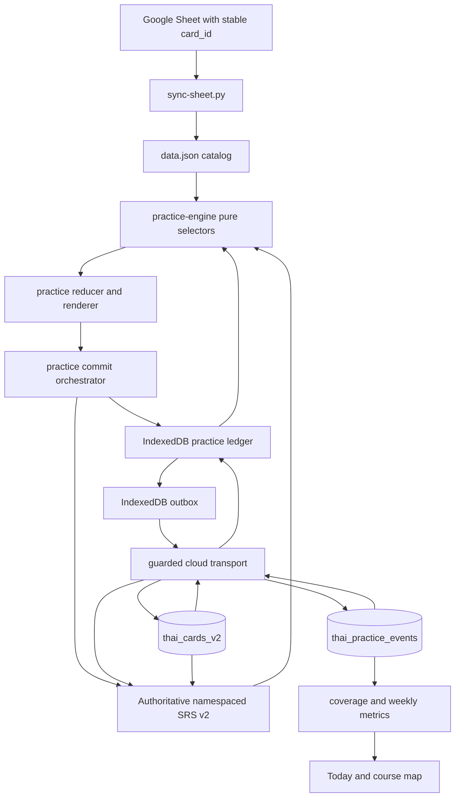
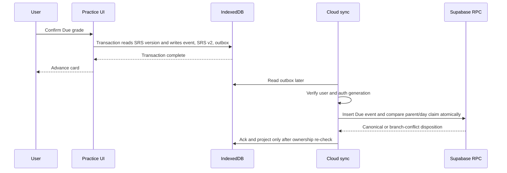
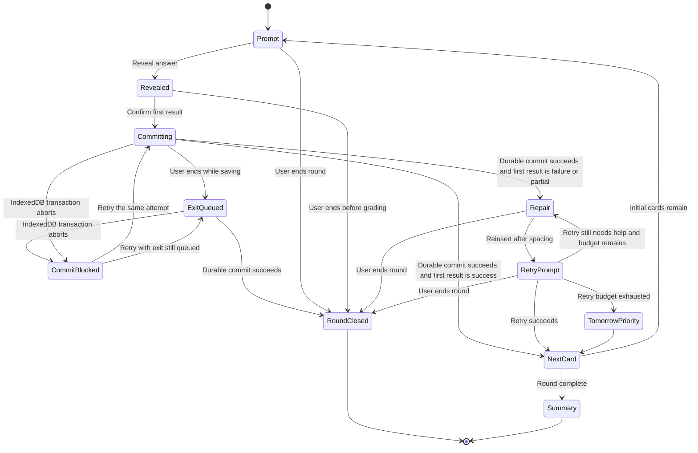

# Hybrid Mastery Practice - Plan

## Goal Capsule

- **Objective:** 讓清心安神以低壓、可中斷、可跨裝置的 10 張混合回合，加快全課程掃描並逐步建立主動輸出能力。
- **Means:** 以 stable card ID、append-only practice ledger、四軌純函式 queue engine 與獨立 practice state machine 實作（KTD1、KTD3、KTD6）。
- **Authority:** 產品行為以 R1–R24 為準；實作機制以 KTD1–KTD13 為準；原始設計只在本計畫明確引用的 UX 文案提供脈絡，名額與門檻以 R2 的完整定義為準。
- **Execution profile:** 先完成資料可信度與 migration，再接 queue、UI、統計與正式部署。
- **Stop conditions:** stable ID 對照不完整、跨帳號資料污染、Due 重複套用 SRS、事件同步漏列或 production read-back 不一致時，不得進入下一階段或宣告上線。
- **Tail owner:** Production 發布由 `scripts/update-audio-deploy.sh --deploy` 完成，並以 deployment URL 的資產 hash 與全新頁面回合 read-back 驗收。

---

## Product Contract

### Summary

首頁提供單一主要入口，依最新學習事實建立最多 10 張的 Sweep、Due、Weak、Output 混合回合。
每張確認後立即保存，queue 可重建，首次結果、補救結果、正式 SRS 與主動輸出各自保留正確語意。
本計畫是實作時的單一規則來源；原始設計保留需求形成脈絡與 UX 文案，若兩者有落差以本計畫為準。

### Problem Frame

現有每日複習把 due、resweep 與弱項組成長 queue，會因扁平游標、交錯插入及中途離開而跳過卡片。
現有 SRS、日誌、grade history 與雲端同步分散在多個 `localStorage` key，一次 Due 評分無法保證 event 與排程一起成功。
目前 `cardKey()` 使用 `lessonId:sourceThai`；現有資料快照有 13,632 張卡、12,968 個唯一 legacy key，無法代表每一張卡，也會在泰文修訂後改變。
這些限制若不先修，新的覆蓋率、救回率與跨裝置 union 會產生看似合理但不可信的數字。

### Key Decisions

- **以全課程熟練速度優先，再補主動輸出。** (session-settled: user-directed — chosen over output-first or UI-first: Nalin selected B>A>C) Governs R1–R6、R19–R21。
- **採四軌動態混合回合。** (session-settled: user-approved — chosen over fixed ratios or black-box adaptation: the rules remain explainable and adapt only between rounds) Governs R1–R10。
- **第一次結果與補救結果分帳。** (session-settled: user-approved — chosen over overwriting a wrong answer after recovery: the product must preserve both ability and teaching effect) Governs R7–R12。
- **第一版不加入錄音、ASR 或 AI 對話。** (session-settled: user-approved — chosen over voice scoring: existing teacher audio and self-rating are sufficient for the first productive-recall loop) Governs R8、R23。
- **不顯示虛構精通率或壓力型獎勵。** (session-settled: user-approved — chosen over XP, punishment, countdowns, and one mastery percentage: progress remains factual and low pressure) Governs R19–R23。

### Actors

- A1. Nalin 在手機、平板或桌面瀏覽器完成回合，可能中途背景化、離線或換裝置。
- A2. PWA 在本機先保存學習事實，依事實重建 queue 與衍生統計。
- A3. Supabase Auth 與 Data API 只同步目前 user ID 的資料，並以 RLS 阻止跨帳號讀寫。
- A4. Google Sheet 與 `data.json` 提供課程內容及不可變 card ID。

### Requirements

**回合與選題**

- R1. 每次開始時依最新資料建立最多 10 張的暫時回合，不持久化一條長期 queue。
- R2. 常態名額為 Sweep 4、Due 3、Weak 2、Output 1；若 Due 壓力成立則為 4／4／2／0，上一回合首次 `failure + partial >= 3` 則為 4／3／3／0，Due 為 0 且上一回合首次成功率 `>= 70%` 則為 6／0／2／2。條件只在回合邊界依上述順序選一個模板；沒有上一回合時使用常態模板。
- R3. 候選足夠時 Sweep 至少占回合初始卡的 40%，Due 最多占 40%；Sweep 候選不足時全部採用後再按 Due、Weak、Output 的順序補位，且不得用重複卡湊數。
- R4. 同一 card ID 在同一回合只占一個初始名額，碰撞優先序為 Due、Sweep、Weak、Output。
- R5. 同日正式 Due、Sweep、Weak、Output 各自去重；同一 attempt 的最多兩次 retry 不受 Weak 去重限制。
- R6. 排序需保留相對逾期、課程順序、課次交錯與同軌或同課不連續超過三張的可解釋規則。

**作答、補救與 SRS**

- R7. Sweep、Weak、Output 只寫 practice event，不改 `nextReviewAt`、interval 或 ease factor。
- R8. Output 以中文提示要求使用者先說泰文，再揭曉泰文、Karaoke 與教師音檔並自評。
- R9. 四軌回合內只有 Due 的 `phase:first` 可更新一次正式 SRS，event 同時保留 Again、Hard、Good 或 Easy。
- R10. `failure` 或 `partial` 最多回鍋兩次；首次結果不被 retry 覆寫，只有首次 failure 後成功才計 recovered。
- R11. 第三次仍需補救時停止該 card 的當日循環並列入明日優先。
- R12. 每張確認後先完成本機 durability commit 才前進；重整最多重做尚未確認的當下卡。

**掃描、身份與資料變動**

- R13. 每張課程卡使用來源端永久保存且全域唯一的 card ID；內容修改與排序不得改變 ID。
- R14. Sweep 或尚未掃描的 Due 完成 unaided first response 後，才算進目前 cycle 的覆蓋集合。
- R15. 新卡加入目前 cycle 分母，刪除卡移出分母，內容修訂且 ID 不變時保留完成狀態。
- R16. 全部現存卡完成後寫入帶 catalog revision 的完成 observation；使用者主動開始下一 cycle 時，才把前一 ordinal 依當時 catalog snapshot 封存。若開始下一 cycle 前 catalog 新增卡，原 cycle 重新顯示未完成。
- R17. 既有 SRS、grade history、daily log、遊戲紀錄與可證明的掃描事實需經冪等 migration 保留。

**離線、帳號與同步**

- R18. 本機所有學習資料依 anonymous workspace 或 Supabase user ID 分區，不得自動把第二個帳號與既有帳號合併。
- R19. Practice events 以 event ID 做 append-only set union，跨裝置同步不得以整包 LWW 覆寫。
- R20. 登出、切換帳號、timeout 或 reset 後，舊 operation 不得修改新 workspace、cursor、統計或畫面。
- R21. Due event 與已計算的 SRS after-state 必須可重播且冪等，不得重新計算造成 interval 二次前進。

**體驗、統計與邊界**

- R22. 首頁只有一個視覺上主要的混合回合 CTA；遊戲、單課字卡與其他工具保留為次要入口。
- R23. 回合不顯示倒數、落後警告、XP、扣心、排行榜或未定義的總精通率。
- R24. 進度頁分開呈現 cycle coverage、due 七日趨勢、首次 failure 與 recovered、Output 三態分布及每週自然語句。

### Key Flows

- F1. 建立回合
  - **Trigger:** A1 按下首頁主要 CTA。
  - **Steps:** A2 確認完整課程 catalog；讀取目前 workspace 的 SRS、cycle 與今日事件；選模板；去重並交錯候選。
  - **Outcome:** 進入最多 10 張的短回合，或顯示沒有可用候選的明確空狀態。
  - **Covered by:** R1–R6、R22。
- F2. Due 原子保存
  - **Trigger:** A1 確認 Due 的首次正式評分。
  - **Steps:** A2 在同一 IndexedDB transaction 取得該 workspace／card／台北日的正式 Due claim、讀取目前 per-card version，計算 SRS after-state，再寫入 immutable event、SRS v2 row 與 outbox。
  - **Outcome:** event 與 SRS 同時 commit；transaction 未完成時 UI 不前進。
  - **Covered by:** R9、R12、R21。
- F3. 補救回鍋
  - **Trigger:** 首次或 retry 結果為 failure 或 partial。
  - **Steps:** A2 提供階梯式支架並把卡插回；retry 共用 attempt ID；達上限後停止。
  - **Outcome:** first result、retry 與 recovered 可分別重建。
  - **Covered by:** R10、R11。
- F4. 中途離開與重整
  - **Trigger:** A1 主動結束、關頁、重整或 PWA 背景化。
  - **Steps:** 已完成 transaction 的事件與 SRS 保留；未回答的初始候選不保存；未完成 transaction 不算 confirmed answer；新回合排除今日已完成項目。
  - **Outcome:** 不重做已確認作答，也不依賴舊 queue 游標。
  - **Covered by:** R1、R5、R12。
- F5. 離線 union 與帳號切換
  - **Trigger:** 兩裝置離線作答後連線，或 A1 登出再登入另一帳號。
  - **Steps:** A2 先按 workspace 落地；A3 依 event ID 冪等上傳與增量拉取；每個 await 後檢查 user 與 generation。
  - **Outcome:** 同帳號事件收斂為 union；不同帳號永不互相可見或寫入。
  - **Covered by:** R18–R21。
- F6. 完成與開始新 cycle
  - **Trigger:** 現有 catalog 的 card IDs 全部有合格 first response。
  - **Steps:** A2 寫入 cycle completion event並顯示完成畫面；只有 A1 明確操作才建立下一 ordinal cycle。
  - **Outcome:** 寫入完成 observation；使用者明確開始下一 cycle 時，前一 cycle 才依 snapshot 封存且不與新集合混合。
  - **Covered by:** R13–R16、R24。

### Acceptance Examples

- AE1. **Covers R2–R4.** Given 一般候選充足，when 建立回合，then 初始 cards 為 4 Sweep、3 Due、2 Weak、1 Output，且 card IDs 全部唯一。
- AE2. **Covers R4、R9、R14.** Given 一張卡同時 Due 且尚未 Sweep，when 首次評分，then 只顯示一次 Due，更新一次 SRS，並完成該 cycle coverage。
- AE3. **Covers R7、R10.** Given Sweep 首次 failure 後 retry2 success，when 回合結束，then SRS 不變、first result 仍為 failure、recovered 為 true。
- AE4. **Covers R12、R21.** Given Due transaction 在 commit 前或後遭遇重整，when App 啟動，then 前者不產生 confirmed answer，後者同時保留 event 與同一版 SRS after-state，且不二次延長 interval。
- AE5. **Covers R18–R20.** Given User A 的延遲 pull 在登出後才回應，when User B 已登入，then User B 的 state、events、remote days 與 cursor 全部不變。
- AE6. **Covers R13、R15.** Given 課程排序或泰文內容修改但 card ID 不變，when catalog 更新，then既有 SRS 與 coverage 仍指向同一卡。
- AE7. **Covers R17.** Given 舊 resweep 只有 position 且無可信 card evidence，when migration，then 不把位置前綴冒充 completed IDs，SRS 仍完整保留，migration 重跑不增加事件。
- AE8. **Covers R19.** Given兩裝置離線各新增不同 events，when 重新同步，then遠端與兩端 IndexedDB 最終都有完整 union，重送同一 event 不改寫原 payload。
- AE9. **Covers R7、R24.** Given使用者只完成 Sweep、Weak、Output，when查看今日與本週摘要，then這天算有練習，但 SRS reviewed 與正式正確率不增加。
- AE10. **Covers R5、R19、R21.** Given兩裝置離線從同一卡的相同SRS parent正式評分，when以任一順序同步，then第一個由server原子接受的child是canonical，另一筆與其後代保留為branch conflict但不二次推進SRS或正式統計，兩端最後一致。

### Success Criteria

- 每個驗收案例都有自動測試或 Browser QA 證據，且 AE4、AE5、AE8 必須由 transport／crash simulation 驗證。
- migration 前後可核對 catalog card count、stable ID uniqueness、legacy SRS entry count、practice event count 與 coverage count。
- Production 前以完整 catalog 驗證人工核准的 `output_ready` 候選集合；Output lane 不可用未核准的長度或形狀 heuristic 補位。
- Production 以全新頁面完成一個含至少兩種 lane 的回合，重整後結果仍存在，部署資產 hash 與 package read-back 一致。
- 上線後第 2 週檢視實際 lane composition 與 cycle coverage 速度；若長期偏離 R2 或 Sweep 進度不符預期，另開比例調整 follow-up，不在 runtime 提供手動調整。

### Scope Boundaries

**Included**

- 現有同步正確性、帳號隔離、stable identity、事件 durability、四軌回合、掃描 cycle、進度投影與必要 UI 調整。
- 一次性的 Sheet card ID backfill、versioned Supabase migration、RLS 與 transport tests。
- 現有錯卡音訊與跨課程教師音檔 preload 修正。

**Deferred to Follow-Up Work**

- 把 13,632 張卡全部整理成 phrase／sentence 分類；第一版只使用小型、人工核准的 `output_ready` launch set。
- 事件壓縮、冷儲存或資料匯出；先以實際 IndexedDB 與 Supabase 數量觀察。
- 將晚到的 v1 quarantine facts 人工解析；v1 正式寫入會在 KTD13 協調切換時停止。

**Outside this product identity**

- ASR、錄音、AI 對話、FSRS、社交、排行榜、XP、扣心、倒數與比例手動調整。

---

## Planning Contract

### Key Technical Decisions

- KTD1. **來源端 UUID 是唯一 canonical card ID。** `Google Sheet → data.json → runtime → local/remote state` 全鏈使用不可變 `card_id`；內容 hash、列號與 `lessonId:thai` 只作 legacy alias。Favorites 保留「收藏泰文字形」的 lexical semantics，不作學習進度 identity。這是 R13–R17 的身份基礎。
- KTD2. **Learning workspace 全面分區。** `auth`、裝置全域 ID 與課程 cache 可維持裝置全域；SRS、edits、favorites、daily log、grade history、achievements、cycle、events、outbox 與 cursors 全部以 `anon:<deviceId>` 或 `user:<uid>` namespace。遠端若需辨識安裝實例，只送 per-workspace installation ID。第一次登入只在 namespaced local stores 為空、第一次成功 remote pull 為 0 rows，且使用者確認時認領 legacy data；任一不成立就保留 legacy snapshot、不顯示認領。登出切回 anonymous workspace並 reload。這實作 R18、R20。
- KTD3. **IndexedDB 同時保存 authoritative SRS v2、append-only events 與 outbox。** Due 在單一 per-workspace transaction 先取得 unique `workspace + cardId + dayKey + formal-due` claim，再讀取 `srsBeforeVersion`，計算並寫入 `srsAfterVersion`、event、card progress 與 outbox；這個唯一 claim 與 object-store transaction serialization 一起防止多 tab 同日重複正式評分。跨裝置從同一parent或同一日分叉時，remote disposition選定第一個原子接受的canonical child；其餘event保留為branch conflict，但不計正式SRS、reviewed或accuracy，後代也不得回灌。`state.progress` 只是 boot 後的記憶體 projection，legacy localStorage mirror 可重建且不作 truth source。Boot 會呼叫 `navigator.storage.persist()`／`estimate()` 並記錄 diagnostics；被拒時提示登入並優先排空 outbox。這實作 R5、R12、R19、R21。
- KTD4. **遠端事件表由資料庫強制 append-only並驗payload identity。** 新增`thai_practice_events`，使用`server_seq`與unique `(user_id,event_id)`；canonical payload只含不可變學習事實，不含user、workspace或裝置ownership envelope。資料庫依固定`payload_version`的normalized JSONB自行產生`payload_hash`，client不可指定hash；同ID不同payload要quarantine，不得被ignore-duplicates假裝成功。非正式Due事件使用`on_conflict=user_id,event_id`與strict preferences；Formal Due改走單一database RPC，在同一transaction寫event、daily／parent-version disposition與cards v2 CAS。兩條路徑都要檢查`Preference-Applied`或read-back。Quarantined outbox row轉成non-retryable終態，不阻擋後續事件。只授權authenticated `SELECT, INSERT`，RLS綁`auth.uid()`，不授權`UPDATE, DELETE`。Migration同時包含明確GRANT、identity sequence grant、indexes、policies與REST smoke test。這實作R19。
- KTD5. **`cloud-sync.js` 是唯一 sync coordinator。** Coordinator 擁有 workspace、user ID、auth generation、AbortController、in-flight token、timer 與 commit guard；transport helpers 保持無全域狀態，只有出現第二個實際 consumer 時才拆成 `practice-sync.js`。每輪先捕捉有限 `pullHighWater`，只拉 `cursor < serverSeq <= pullHighWater`，每頁資料與 page cursor 同一 IndexedDB transaction 落地。因 `server_seq` 順序不保證等同 commit 可見順序，每輪完成都比對 remote exact count；不一致就執行同樣有 high-water 的 bounded reconciliation。未知 `payloadVersion` 或不存在於目前 catalog 的 card ID 先 quarantine，不進 projection。Mutable card rows 用雙欄 keyset，整輪成功後才 commit watermark。這實作 R19、R20。
- KTD6. **四軌 engine 與 UI state machine 分離。** `practice-engine` 是可注入 now、RNG 與 ID 的純函式；`practice` reducer 管理 reveal、first、retry、exit 與 summary；既有 `gradeAndAdvance()` 不供 Sweep、Weak、Output 使用。這實作 R1–R12。
- KTD7. **Legacy migration 寧可 quarantine，不得複製不確定事實。** Legacy alias只有在全部可追溯production catalog snapshots都指向同一card lineage時才可搬移；current catalog唯一但缺少歷史證據、曾碰撞、曾被重用或指向不同lineage者都進`legacy_unresolved`，完整保留原snapshot且不寫新card SRS或coverage。只有額外逐卡證據能唯一resolve時才搬移。舊resweep position也只在固定catalog snapshot與逐卡證據可驗證時才轉coverage。這實作R17。
- KTD8. **Cycle 使用帳號內單調 ordinal，完成 observation 對 current catalog 計算。** 同一 ordinal 使用 deterministic cycle ID；cycle complete event 帶 `catalogRevision` 與 card-count observation，只記錄當時狀態。使用者開始下一 ordinal 前，active cycle 仍由 current catalog card-ID set 與 qualifying first events重算；明確開始下一 cycle 的 transaction 才封存前一 ordinal 的 catalog snapshot，此後新增卡歸入新 ordinal。以現有 13,632 張卡與常態每回合 4 張 Sweep 計算，一個 cycle 約需 3,408 回合，因此第一版的核心價值是可持續的 coverage projection，完成畫面是長尾狀態。這實作 R14–R16、R19。
- KTD9. **既有一般字卡評分暫時保留為手動正式複習。** R9 的限制只適用四軌回合；既有單課 card／reverse 入口不在本輪退場，避免無關使用習慣回歸。
- KTD10. **Output 第一版只使用人工核准候選。** Sheet 增加可選的 `output_ready` 欄位，或由同一來源維護等價的 stable-ID allowlist；只有經內容檢查並核准的 cards 可進 Output pool。未核准卡不得靠泰文長度、中文形狀或 AI 推測補位；候選不足時依 R3 縮減 Output 或交給其他 lane。
- KTD11. **意外中斷與主動離開分開處理。** Crash／重整只看 IndexedDB transaction 是否完成；已 commit first 不重做，未 commit card 可重做。不保存原 queue 的精確插入位置。使用者按「今天先到這裡」時寫 round-close event，未完成 retry 轉明日優先。這實作 R1、R11、R12。
- KTD12. **現有「重置進度」只重置 SRS projection。** Reset epoch 同時約束 v1 與 `thai_cards_v2`，使其他裝置的 pre-reset progress 不會回灌；practice history 保持 append-only，cycle 另由明確開始動作管理。刪除全部歷史屬未授權的破壞性新功能，不在本計畫內。
- KTD13. **v1 與 v2 採單一使用者的協調切換。** Cutover 前逐台開啟已知 PWA 裝置、排空 v1 sync、核對遠端與本機未同步數為 0，並匯出 v1 remote rows、v2 tables 與各裝置 IndexedDB。接著以 server-side schema gate 停止 v1 writes、發布 v2-only client並逐台 fresh refresh；只保留 read-only late-v1 quarantine importer，不做雙向 bridge。接受 v2-only facts 後採 roll-forward，不宣稱可無損退回舊 client。

### High-Level Technical Design

### Data Contracts

**Catalog card**

- `cardId`: required UUID string from Sheet.
- `legacyCardKey`: derived `lessonId:sourceThai` for migration only.
- `outputReady`: optional boolean from the human-approved launch set; absent or false cards never enter Output.
- `_lessonId`: current lesson identity used for display, grouping and audio lookup.

**Practice event minimum fields**

- Canonical identity: `eventId`, `eventKind`, `payloadVersion`; fixed field set per payload version, normalized JSONB key ordering and number representation由資料庫定義並產生 `payloadHash`。
- Ownership envelope: local `userWorkspace` 與裝置全域 ID 不進 canonical payload；remote row 使用 `user_id` 與可選的 per-workspace installation ID。
- Context: `roundId`, `cycleId`, `cycleOrdinal`, `cardId`, `dayKey`；`dayKey` 一律按 Asia/Taipei 產生。
- Attempt: `attemptId`, `lane`, `phase`, `result`, optional `formalGrade`, `occurredAt`.
- Recovery and replay: Due first 必填 `srsBeforeVersion`、`srsAfterVersion` 與完整 `srsAfter`；round start 保存 `roundTemplate`。
- Catalog observation: cycle complete 保存 `catalogRevision` 與 `catalogCardCount`，但不取代 current-catalog projection。
- Remote order: server-managed `serverSeq` and `receivedAt`；client time 永遠不作唯一 watermark。

### Sequencing and Release Gates

1. U1 與 U3 先修正現有 sync failure contracts；這些安全修正不等待 production Sheet mutation。
2. U2 與 U10 完成 stable ID、workspace resolution 與保守 migration；證據不完整就停止。
3. U4 建立本機 immutable fact path，U6 建純 engine；crash、重複 Due、比例與 retry tests 未通過就不接 render。
4. U7 先以本機 durability 完成可操作回合；U5 隨後接遠端 append-only convergence，production release 前 RLS、duplicate、pagination、late-commit 與 logout race 必須全部通過。
5. U8 接 coverage 與 metrics；U9 更新 cache、文件與部署路徑，production read-back 成功才算完成。

### System-Wide Impact

- **Data lifecycle:** 新 practice facts 保留到帳號刪除；SRS v2 是目前排程的 authoritative mutable state，coverage、recovery與summary才由events投影。帳號刪除由 service-role procedure 或 FK cascade 清除remote rows，本機 workspace 需在使用者確認後清除。
- **Authentication:** App 啟動、登入、登出與 reset 都會切換或 fence workspace；不得再由固定 key 直接載入所有學習資料。
- **Content pipeline:** Sheet 多一個必填 `card_id` contract；`src/data.js` 與 `scripts/sync-sheet.py` 的 alias、驗證與 fail-closed 行為必須完全一致。
- **Offline posture:** 已安裝 PWA 可能長時間使用舊 cache；所有新增 module 必須進 `sw.js` shell，cache version 與測試一起更新。
- **Operations:** Repo 需要保留 Supabase schema、RLS tests 與 production REST read-back，不再只靠 Dashboard 手動設定。

### Risks and Mitigations

| Risk | Impact | Mitigation |
|---|---|---|
| Sheet backfill 寫錯列或重複 UUID | 全課程 identity 失真 | dry-run、Sheet backup、逐 tab count、uniqueness check、write read-back；實際寫入前取得 production data mutation 確認 |
| Legacy key collision 無法判斷實際卡片 | 錯誤搬移 SRS、coverage 或 history | KTD7 將 ambiguous facts quarantine，維持原 snapshot 與守恆 audit |
| IndexedDB transaction、quota 或 version upgrade 失敗 | Due event 與 SRS 無法可靠落地 | KTD3 同 store transaction、fail-closed UI、真實瀏覽器 lifecycle tests |
| 瀏覽器在長期未使用後清除 script-writable storage | 未同步 practice events 與 authoritative SRS v2 遺失 | persistent-storage request、diagnostics；被拒時提示登入並優先排空 outbox |
| Sequence cursor 遇到並行 commit | 增量 pull 漏 event 或無限追逐新資料 | KTD5 有限 high-water、同 transaction page commit、每輪 exact-count check 與 bounded reconciliation |
| 同 event ID 帶不同 payload | Client ack 與 server truth 永久分歧 | KTD4 canonical payload hash；異值 quarantine並拒絕 ack |
| Cycle completion 來自舊 catalog | 新卡被漏掉卻顯示完成 | KTD8 在下一 cycle 開始前把 completion 當 observation並對 current catalog 重算 |
| 舊 auth response 晚回來 | 跨帳號污染 | abort + user/generation guard + namespaced commit；server 端仍以 RLS ownership 擋寫入 |
| Event 累積造成容量壓力 | 本機或遠端變慢 | IndexedDB indexes、分頁 projection、outbox ack；不在第一版做未量測的壓縮 |
| Output 核准候選不足 | 回合缺少 Output 卡 | KTD10 只使用人工核准 set，候選不足依 R3 縮減，不拿低品質卡冒充輸出練習 |
| Service Worker 留住舊 schema client | 新舊 client 同步衝突 | 依 KTD13 逐台排空、server-side v1 write gate、cache bump、fresh-page QA與late-v1 quarantine importer |

### Operational Rollout Notes

1. 先完成 U2 Gate A、Sheet backup 與 mutation manifest；取得 production Sheet write 批准後才 backfill。
2. Sheet read-back通過後產生新 `data.json`，再啟用 mandatory parser enforcement；舊 production bundle保持可用。
3. U5 baseline migration先由production schema export產生並核對 checksum；既有 production 專案只把該 baseline version標記為已套用，不重跑建表 DDL，再套 additive v2 migration。Apply前保存schema、grant、policy、完整remote data export與per-user row-count snapshot。
4. Cutover 前匯出每台已知裝置的 IndexedDB、逐台排空 v1 sync並驗未同步數為 0；新tables未通過RLS與REST smoke test時不啟用frontend v2 writes。
5. Preview先驗workspace boot、真實IndexedDB、四軌回合、late-v1 read-only quarantine與fresh reload，再以server-side gate停止v1 writes並部署Production Pages。
6. 一旦production接受v2-only practice facts，故障處理採roll-forward；不得切回看不到stable-ID facts的舊client並宣稱無資料損失。

### Sources and Research

- `src/state.js` 的 `cardKey()`、固定 learning storage key 與 SRS projection。
- `src/cloud-sync.js` 的 offset pull、single `inFlight`、outgoing row filter、reset 與 keepalive path。
- `src/today.js`、`src/resweep.js` 的扁平 position queue 與 current daily projections。
- `src/cloud-merge.js` 與 `docs/cloud-sync-2026-08.md` 的分組 LWW、RLS 與既有 remote contract。
- [Supabase Row Level Security](https://supabase.com/docs/guides/database/postgres/row-level-security)
- [Supabase Data API security and grants](https://supabase.com/docs/guides/api/securing-your-api)
- [Supabase 2026 new-table Data API breaking change](https://supabase.com/changelog/45329-breaking-change-tables-not-exposed-to-data-and-graphql-api-automatically)
- [PostgREST tables, bulk insert and upsert](https://postgrest.org/en/stable/references/api/tables_views.html)
- [PostgREST pagination](https://postgrest.org/en/stable/references/api/pagination_count.html)
- [MDN IndexedDB transactions](https://developer.mozilla.org/en-US/docs/Web/API/IndexedDB_API/Using_IndexedDB)
- [Supabase Auth sign-out lifecycle](https://supabase.com/docs/guides/auth/signout)
- [WHATWG Fetch keepalive limits](https://fetch.spec.whatwg.org/)

---

## Implementation Units

### Unit Index

| Unit | Deliverable | Depends on |
|---|---|---|
| U1 | Characterization tests for current failures | — |
| U2 | Stable card identity and source migration evidence | U1 |
| U3 | Existing mutable-sync correctness | U1 |
| U10 | Workspace boot, claim and legacy learning migration | U2、U3 |
| U4 | Durable local practice ledger and SRS conflict model | U10 |
| U6 | Four-lane queue and retry engine | U2、U4 |
| U7 | Local-first practice UI and audio ownership | U4、U6、U10 |
| U5 | Append-only cloud convergence and RLS | U2–U4、U10 |
| U8 | Coverage and progress projections | U4–U7 |
| U9 | Cache, documentation and production release | U2–U8、U10 |

### U1. Characterize identity and sync failure modes

- **Goal:** 先把已知資料錯位與競態變成會失敗的測試，避免 foundation 修改靠人工猜測。
- **Requirements:** R12、R13、R18–R21。
- **Dependencies:** None。
- **Files:**
  - Create: `tests/cloud_sync.test.mjs`
  - Create: `tests/storage_scope.test.mjs`
  - Modify: `tests/data.test.mjs`
  - Modify: `tests/resweep.test.mjs`
  - Modify: `tests/real_audio.test.mjs`
  - Create: `tests/card_audio.test.mjs`
- **Approach:**
  1. 為 `cloud-sync` 建立可注入 fetch、session、clock 與 abort signal 的 test harness，不先改 production merge semantics。
  2. 固定重現 pulled remote progress 造成同卡 local history／edit 被整列濾掉、offset 分頁漏列、舊 in-flight 污染新帳號及舊 finally 清掉新 operation。
  3. 固定重現 legacy card-key collision、resweep cursor skip 與切卡後 stale audio completion。
- **Execution note:** 這個單元只建立 characterization 與最小 test seams；不要順手重構同步模組。
- **Patterns to follow:** `tests/cloud_merge.test.mjs` 的 localStorage stub與 pure merge fixtures；`tests/today.test.mjs` 的固定 now／card fixtures。
- **Test scenarios:**
  - 同一卡遠端 progress 較新、本機 history 或 edit 較新時，本機欄位仍出現在 outgoing payload。
  - `PAGE + 1` rows 在同步中插入或更新時，現有 offset case 可穩定重現漏列。
  - User A 的 delayed response 在 User B 啟動後回來，不得 commit 到 B。
  - 重複 `lessonId:thai` 與內容修訂會證明 legacy key 不唯一也不穩定。
  - Interleaved resweep 評分後，較早未答卡不能被 position 跳過。
  - Card A 的慢 audio lookup 在 Card B 已 render 後完成，不得變成 B 的播放來源。
- **Verification:** 測試能在未修前精確指出 failure contract，且 fixture 不依賴 production network 或真實時間。

### U2. Establish stable card identity and conservative legacy migration

- **Goal:** 讓每張課程卡有來源端永久 ID，並把可證明的 legacy SRS 與 resweep 事實冪等搬到新 identity。
- **Requirements:** R13–R17；KTD1、KTD7。
- **Dependencies:** U1。
- **Files:**
  - Create: `scripts/backfill-card-ids.py`
  - Create: `tests/backfill_card_ids_test.py`
  - Create: `data/card-id-lineage.json`
  - Create: `data/output-ready-launch.json`
  - Create: `src/card-identity.js`
  - Create: `tests/card_identity.test.mjs`
  - Modify: `src/data.js`
  - Modify: `scripts/sync-sheet.py`
  - Modify: `tests/data.test.mjs`
  - Modify: `tests/sync_sheet_test.py`
  - Modify: `src/state.js`
  - Modify: `src/srs.js`
  - Modify: `src/stats.js`
  - Modify: `src/game-listen.js`
  - Modify: `src/game-combo.js`
  - Modify: `src/home.js`
  - Modify: `src/app.js`
  - Modify: `src/grade-history.js`
  - Modify: `src/cloud-merge.js`
  - Modify: `tests/srs.test.mjs`
  - Modify: `tests/stats.test.mjs`
  - Modify: `tests/game_listen.test.mjs`
  - Modify: `tests/game_combo.test.mjs`
  - Modify: `tests/home.test.mjs`
  - Modify: `tests/grade_history.test.mjs`
  - Modify: `tests/cloud_merge.test.mjs`
  - Modify: `src/resweep.js`
  - Modify: `tests/resweep.test.mjs`
  - Modify: `README.md`
- **Approach:**
  1. Gate A 先加入 backward-compatible reader、pure alias mapper 與 backfill dry-run，不啟用 mandatory ID enforcement。
  2. Backfill 產生 immutable mutation manifest，包含 spreadsheet ID、gid、row、原欄位 fingerprint、old ID 與 new ID；同時建立repo-tracked card-ID lineage registry。Write 前重讀並 compare-and-abort；write 後證明原欄位逐格不變，rollback 只還原 ID 欄。
  3. Sheet IDs read-back 全部通過後，先用 backward-compatible parser 產生並驗證新 `data.json`；確認 package 可讀後，Gate B 才啟用兩套 parser 的 exact aliases 與 mandatory fail-closed驗證，最後更新deploy preflight。
  4. `src/card-identity.js` 成為唯一 canonical／legacy alias API。Progress、history、edits、due、stats、games 與 deep links 改用 card ID；舊 deep link 可透過唯一 alias轉址，favorites 依 KTD1 保持 lexical semantics。
  5. 每次sync與deploy都把current catalog對照lineage registry；未在mutation manifest宣告的既有ID消失、row lineage換ID或UUID替換一律fail closed。
  6. 以stable ID 建立小型 `output_ready` launch set：先輸出候選與理由供人工核准，只有核准結果可寫回來源或allowlist；不得由AI自行把全catalog分類。
  7. 本單元只產生 historical alias migration matrix 與 quarantine plan，不在 workspace 尚未確定前改寫任何 learning store。Dry-run另統計collision group與持有非空SRS／grade history的交集數、比例及明細。
  8. 將現有 resweep 修成不再依 interleaved queue 推進 flat position；新 coverage migration 只接受可驗證 card evidence。
- **Execution note:** Sheet write 是 production data mutation；先完成 dry-run 與備份證據，再取得明確批准才執行 write mode。
- **Patterns to follow:** `scripts/write-dialogues-sheet.py` 的 dry-run、explicit write、row count與 read-back；`src/data.js` 與 `scripts/sync-sheet.py` 的 alias parity。
- **Test scenarios:**
  - 所有 catalog cards 的 `cardId` 非空且全域唯一。
  - 調整列序、修改泰文／中文後，既有 `cardId` 不變。
  - Backfill 重跑不改已存在 ID，也不建立第二組 UUID。
  - 已存在的有效UUID若被換成另一個有效UUID，lineage preflight仍拒絕未宣告替換。
  - 任一 tab 缺 ID、ID 格式錯誤或重複時，sync-sheet fail closed並保留舊 `data.json`。
  - Source-contract scan 找不到 runtime 直接組 `${lessonId}:${thai}` 的旁路；允許的 legacy alias 只存在 `src/card-identity.js` 與 migration fixtures。
  - Legacy alias只有在全部可追溯snapshots維持單一lineage才可解析；無歷史證據或曾碰撞者進quarantine，不產生新 SRS 或 coverage。
  - `outputReady` 只來自人工核准stable-ID set；未核准cards不會被heuristic選入。
  - Dry-run 後若列被插入、排序或內容被改，write 整批停止；rollback 不覆蓋其他欄位的新修改。
  - 無 catalog snapshot 證據的 resweep position 不轉成 completed events。
- **Verification:** 發布順序固定為 Sheet IDs、backward-compatible generated `data.json`、mandatory parser enforcement、App package；card count、UUID uniqueness、lineage continuity、row binding、原欄位hash與Output核准集合可逐項核對，任何gate失敗都保留舊production bundle。

### U3. Isolate workspaces and harden mutable-state sync

- **Goal:** 不等待 Sheet mutation，先修正現有 cloud sync 資料遺失、帳號切換、logout、timeout、pagination與 reset 競態。
- **Requirements:** R20；KTD5、KTD12。
- **Dependencies:** U1。
- **Files:**
  - Modify: `src/cloud-auth.js`
  - Modify: `src/cloud-sync.js`
  - Modify: `src/cloud-merge.js`
  - Modify: `src/state.js`
  - Modify: `src/today.js`
  - Modify: `src/grade-history.js`
  - Modify: `src/achievements.js`
  - Modify: `src/resweep.js`
  - Modify: `src/app.js`
  - Modify: `tests/cloud_sync.test.mjs`
  - Modify: `tests/cloud_merge.test.mjs`
  - Modify: `tests/today.test.mjs`
- **Approach:**
  1. 移除整張 `pulledBack` outgoing filter，保留分組 LWW trigger 決定 progress、history、edit 的採納。
  2. 將 `syncNow` 改為 operation-owned promise；logout／帳號變更先清timer、bump generation、abort owned requests，再切換既有profile並reload。
  3. 普通 fetch 加 timeout與分類retry；mutable rows改雙欄keyset並在整輪成功後才commit cursor。
  4. Reset在auth ownership仍有效時才寫remote epoch；失敗時不清local。
  5. Keepalive依UTF-8 body bytes切batch，只作best-effort，不前移cursor。
- **Execution note:** 先讓 U1 的 transport regression tests 轉綠；每一個 async commit point 都要有 ownership guard。
- **Patterns to follow:** `src/cloud-merge.js` 的 pure-function boundary；現有 reset 先遠端後本機的 fail-safe順序。
- **Test scenarios:**
  - Pulled remote progress 不再吞掉 local newer history／edit。
  - Watermark v1 升級時完整重拉，keyset 多頁在並行插入下最終無漏失。
  - Timeout、AbortError、401、403、5xx 不前移 cursor；只有允許的 transient path bounded retry。
  - A logout 後 delayed pull／push／finally 不改 anonymous 或 B workspace。
  - Reset 期間 session 消失時，本機與遠端都不做半套清除。
  - UTF-8 keepalive batch 未超過限制，超大單筆留給下次普通 sync。
- **Verification:** Current profile 的資料欄位不再因 remote winner 被整列吞掉；timeout、pagination、logout、reset 與 keepalive regression 全部通過。

### U10. Resolve workspaces and migrate learning data

- **Goal:** 在任何學習 read／write 前解析唯一 workspace，安全認領可證明的 legacy data，並把不確定資料完整保留在 quarantine。
- **Requirements:** R17、R18、R20；KTD2、KTD3、KTD7。
- **Dependencies:** U2、U3。
- **Files:**
  - Create: `src/storage-scope.js`
  - Create: `tests/learning_migration.test.mjs`
  - Modify: `src/cloud-auth.js`
  - Modify: `src/state.js`
  - Modify: `src/today.js`
  - Modify: `src/grade-history.js`
  - Modify: `src/achievements.js`
  - Modify: `src/resweep.js`
  - Modify: `src/app.js`
  - Modify: `tests/storage_scope.test.mjs`
- **Approach:**
  1. 建立 blocking boot state machine：checking session、loading catalog、opening storage、migrating、ready、recoverable failure、storage unavailable。每態定義文案、可用動作、返回限制與完成後focus；workspace ready 前不得 render Today、settle day、寫daily log或sync。
  2. 將 learning keys 路由到明確 workspace，並呼叫 storage persist／estimate。裝置全域 ID 不上傳；需要遠端診斷時另建per-workspace installation ID。
  3. Legacy claim 只在 local stores 與第一次remote pull都為空時提供；畫面列帳號、可認領筆數與「將這台裝置的進度加入此帳號」／「先不要」。Claim journal在單一transaction記錄來源snapshot、目標workspace與結果，canonical events不含ownership，所以認領不改event identity。
  4. 只有 legacy alias 在所有可追溯 production catalog snapshots 都指向同一 card lineage 時才一對一搬移；缺少歷史證據、曾碰撞或曾指向不同 lineage的facts進`legacy_unresolved`，並驗證`resolved + quarantined = original`。
  5. Migration 完成顯示一次摘要：已保留、已解析與需要重新掃描的筆數，說明「保守不亂猜」；quarantine 不阻擋未受影響的練習，可查看diagnostics與重新檢查。
  6. 登出清除auth ownership後切回anonymous workspace並reload；舊operation由U3 generation guard擋住。
- **Execution note:** Claim與migration先對copy fixture驗證，再接真實legacy snapshot；任何不守恆都停止並保留來源。
- **Patterns to follow:** `src/cloud-merge.js` 的 pure-function boundary；現有 reset 的先遠端後本機 fail-safe 順序。
- **Test scenarios:**
  - 7 個 boot states 都有明確畫面；storage unavailable時fail closed且不寫假完成。
  - 第一次空帳號顯示完整認領資訊；選「先不要」進入空workspace且legacy snapshot不變。
  - 遠端已有資料的帳號在第二台裝置登入時不顯示認領，也不合併anonymous data。
  - Historical-unique alias一對一保留；current-unique但歷史曾碰撞或無snapshot證據者quarantine。
  - Collision中持有非空SRS或grade history的筆數、比例與明細可在dry-run和migration summary讀回。
  - Claim或migration crash後重跑冪等，resolved、quarantined與original守恆。
  - A、B、anonymous 的 state、daily log、history、achievements、events與cursors完全隔離。
- **Verification:** Browser以anonymous、A、B與第二裝置fixtures走完boot、claim、cancel、failure與recheck；migration報告可逐筆回溯來源且不自動猜collision identity。

### U4. Build the durable local practice ledger

- **Goal:** 以 IndexedDB 建立可逐張保存、可重播且能衍生 daily state 的事件帳。
- **Requirements:** R5、R7–R12、R14、R19、R21；KTD3、KTD8、KTD11。
- **Dependencies:** U10。
- **Files:**
  - Create: `src/practice-db.js`
  - Create: `src/practice-events.js`
  - Create: `src/practice-commit.js`
  - Create: `tests/practice_db.test.mjs`
  - Create: `tests/practice_events.test.mjs`
  - Create: `tests/practice_commit.test.mjs`
  - Modify: `src/state.js`
  - Modify: `src/srs.js`
  - Modify: `tests/srs.test.mjs`
- **Approach:**
  1. 建立 per-workspace authoritative SRS v2、event、formal-Due claim、outbox、cursor、quarantine 與 versioned projection stores；indexes 覆蓋 event ID、day、round、cycle、card 與 sync state。
  2. 統一建立 attempt、round、cycle events；UUID、now、catalog revision 與 transaction adapter 可注入測試。
  3. Due commit 在單一 readwrite transaction先寫unique daily formal-Due claim，再讀目前 card progress，產生遞增 `srsAfterVersion`，一起寫帶parent version的first event、SRS v2與outbox；transaction complete前UI不前進。
  4. 兩裝置離線從同一parent version分叉時，server先接受並原子更新`thai_cards_v2`的child成canonical；後到child及其descendants標為branch conflict，保留作答history但不計formal reviewed、accuracy或authoritative SRS。Client pull到server disposition後校正local SRS；不得用任意LWW覆寫或重算precomputed after-state。
  5. 所有正式 manual grade 與 cloud pull 也走同一 per-card transaction boundary；`state.progress` 在 boot 後由 SRS v2 hydrate，legacy localStorage mirror失敗不影響authoritative commit。
  6. Projection 保存 projector／schema version並能從raw events與server disposition重建；Daily dedupe、上一回合結果、retry狀態與attendance由events衍生，games、branch-conflict facts與正式SRS counters保持分開。
- **Execution note:** Implement new domain behavior test-first；UI 不得直接寫多本帳。
- **Patterns to follow:** `src/stats.js` 的 pure projection；`src/grade-history.js` 的 storage adapter separation；`src/srs.js::nextReview()` 的 pure after-state calculation。
- **Test scenarios:**
  - Transaction 前或中途 abort 不產生 event、SRS 或 outbox 的半套資料。
  - Transaction complete 後立刻 crash，reload 可同時看到 event 與相同 `srsAfterVersion`，不二次延長 interval。
  - 兩個 tab 對同 card 交錯正式評分時，per-card version單調增加，舊 transaction不覆蓋新state。
  - 兩個tab同日對同card同時formal Due時，unique daily claim只允許一筆正式event。
  - 兩裝置離線從同一parent version用不同grade分叉後，不論上傳順序如何，各端都收斂到server接受的canonical branch；losing branch與orphan descendants保留但不計正式統計。
  - IndexedDB quota、blocked、versionchange或不可用時 UI fail closed，不把未保存作答顯示成完成。
  - Sweep、Weak、Output commit 不觸碰 SRS projection。
  - 同 event ID 與 attempt ID 重送不增加 event count。
  - 主動 round close 把未完成 retry 標為 tomorrow priority；意外重整保留已完成 first且不要求原位置。
  - 只做非 Due practice 的日期算 attendance，但 `reviewed` 與 SRS accuracy 不增加。
- **Verification:** Node adapter tests 與 served-origin Browser integration 都通過；真實 IndexedDB create／upgrade、abort、reload、workspace switch、blocked／versionchange、persist denied及不可用storage符合fail-closed contract，formal-Due branch fixtures收斂一致。

### U5. Add append-only cloud events and convergence transport

- **Goal:** 讓 practice events 與 stable-ID card state 在 Supabase 上安全隔離、冪等收斂並可完整驗證。
- **Requirements:** R18–R21；KTD4、KTD5。
- **Dependencies:** U2、U3、U4、U10；可在 U7 本機回合完成後接入，但 production release 前必須完成。
- **Files:**
  - Create: `supabase/config.toml`
  - Create: `supabase/migrations/20260823175200_remote_schema_baseline.sql`
  - Create: `supabase/migrations/20260823175300_hybrid_practice.sql`
  - Create: `supabase/tests/hybrid_practice_rls.sql`
  - Create: `tests/practice_sync.test.mjs`
  - Modify: `src/cloud-sync.js`
  - Modify: `src/cloud-merge.js`
  - Modify: `src/app.js`
  - Modify: `docs/cloud-sync-2026-08.md`
- **Approach:**
  1. 從 current remote schema export versioned baseline並核對checksum；local／新環境可完整重建，既有production只將baseline version標記為applied而不執行建表DDL。之後以additive migration新增`thai_cards_v2`、`thai_practice_events`與branch disposition，不drop或改寫v1 rows。
  2. Migration 同時建立constraints、indexes、RLS、grants、identity sequence grant與schema cache reload notes。Events只允許authenticated SELECT／INSERT；cards v2允許SELECT／INSERT／UPDATE但不得DELETE，且`USING`與`WITH CHECK`都綁`auth.uid()`、禁止更改`user_id`。Formal-Due RPC使用security-invoker語意或等價的明確`auth.uid()`ownership檢查，撤銷PUBLIC execute，只授權authenticated role。
  3. Database由normalized JSONB依`payload_version`產生payload hash並拒絕client-supplied hash。非正式Due事件使用`POST ...?on_conflict=user_id,event_id`與`Prefer: resolution=ignore-duplicates,return=minimal,handling=strict`，檢查`Preference-Applied`；duplicate後read-back的database hash相同才ack，異值進non-retryable quarantine且後續outbox照常排空。
  4. Formal Due透過單一database RPC transaction插入event，並以同一台北日claim與parent version條件更新`thai_cards_v2`；成功者取得canonical disposition，任一條件不符者保留為branch conflict，不能覆寫authoritative SRS。
  5. Pull先捕捉`pullHighWater`，固定拉`cursor < serverSeq <= pullHighWater`；每頁events與page cursor同一IDB transaction commit。每輪再比對remote exact count；不一致就執行不受既有cursor下界限制、仍有high-water的event-ID reconciliation，補回先取得低seq但晚commit的rows。
  6. `thai_cards_v2` 保存stable-ID progress groups、reset epoch、canonical parent／child version與`last_attempt_id`。Cutover時從v1唯一且可證明的lineage冪等搬移；late-v1 importer只讀取並quarantine，不回寫v1或做雙向投影。
  7. `cloud-sync.js`建立唯一operation context；transport helpers透過U1 injection seam保持stateless，不直接寫state、IndexedDB、cursor或timer。只有實作時出現第二個consumer才抽成`src/practice-sync.js`。
  8. Production apply前保存schema、完整remote rows、row-count snapshot與每台已知裝置IndexedDB export；測試credential只放未追蹤env，repo只保存publishable key與fixture。Frontend啟用v2 writes前可停用新path，接受v2-only facts後只roll-forward，不執行破壞性down migration。
  9. 帳號資料保留到帳號刪除；migration附service-role purge／FK cascade procedure與測試帳號cleanup步驟。Logout預設保留本機namespaced data，只有明確清除此裝置才刪。
- **Execution note:** Database grants、RLS、REST smoke test 必須在同一單元完成；SQL Editor 看得到表不算 Data API 驗收。
- **Patterns to follow:** `docs/cloud-sync-2026-08.md` 的 per-group timestamp trigger與 RLS ownership；PostgREST `Prefer: resolution=ignore-duplicates,return=minimal,handling=strict`。
- **Test scenarios:**
  - Anon無 SELECT／INSERT；User A 只能 SELECT／INSERT A rows；User B 無法讀寫 A；authenticated 無 UPDATE／DELETE event權限。
  - User A可更新自己的cards v2但不能改`user_id`；無法patch User B，cards v2無DELETE grant。
  - 同 event POST 兩次或第一次 response遺失後重送，遠端只有一筆且 payload不變。
  - 超過一頁、相同 server timestamp、pull中插入資料時最終 union無漏失或重複。
  - 一筆較低`server_seq`在high-water讀取後才commit，下一輪exact-count reconciliation仍補回。
  - Pull開始後持續插入新events，該輪仍有限完成到high-water，新events留給下一輪。
  - Remote exact count 與 local remote-known count不一致時觸發同樣有high-water的完整reconciliation。
  - 同event ID同payload可安全重送；同ID不同payload明確失敗並轉成不重送的outbox quarantine，後續events仍可上傳且count可讀回。
  - A 的 delayed sync在 B 啟動後不 commit；abort 後 server已完成的 idempotent write可在下次安全拉回。
  - 兩裝置離線從同一parent version評分，first accepted event成canonical，另一支與descendants保留但不改cards v2或正式統計。
  - v1 SRS migration 跑兩次，v2 rows、reset epoch與`lastAttemptId`不重複或倒退；Device 1 reset後Device 2的pre-reset v2 groups不會回灌。
  - Server停止v1 writes後，late-v1 facts只進可見quarantine且不阻擋v2 sync。
  - 未知payload version、database hash不一致或catalog不存在的card ID不進projection，並出現在needs-attention diagnostics。
  - Adapter回傳後若operation ownership已失效，coordinator不commit任何state、IDB或cursor。
- **Verification:** Local Supabase reset與 pgTAP通過；production baseline adoption演練不重建既有objects；served-origin Browser完成offline outbox、reconnect、branch conflict、remote ack與second-device pull；production同型REST以兩個可清除測試帳號驗證grants、RLS、server-derived hash、payload collision、pagination、late commit與logout race。

### U6. Implement the four-lane queue and retry engine

- **Goal:** 以純函式產生符合比例、碰撞、去重、排序與回鍋規則的短回合。
- **Requirements:** R1–R11；KTD6、KTD10。
- **Dependencies:** U2、U4。
- **Files:**
  - Create: `src/practice-engine.js`
  - Create: `tests/practice_engine.test.mjs`
  - Modify: `src/srs.js`
  - Modify: `tests/srs.test.mjs`
  - Modify: `src/stats.js`
- **Approach:**
  1. 由 catalog、SRS、active cycle、today events與previous-round projection建立四個候選池。
  2. 按模板與 Due、Sweep、Weak、Output collision priority分配唯一 card IDs，再依 floor、cap與補位規則處理不足。
  3. Due加上相對逾期、較久未正式評分與課次交錯 tie-breaker；Output pool只接受KTD10人工核准cards。
  4. Queue item攜帶 lane、countsForSweep、attempt context與不洩漏答案的 presentation contract。
  5. Retry scheduler只處理原 attempt，插回3張後與4–6張後；不足間隔時排在現有回合尾端，主動離開依KTD11結束。
- **Execution note:** Implement domain behavior test-first；不要把 DOM、storage或 network 引入 engine。
- **Patterns to follow:** `src/game-combo.js` 的 injected time／RNG；`src/stats.js`與`src/srs.js`的 pure selectors。
- **Test scenarios:**
  - 常態、due壓力、失誤較多、due清空穩定四種模板逐一符合名額。
  - Previous round不存在或 first success恰好70%時選到正確模板。
  - Due＋Sweep collision只出現一次，lane為Due且countsForSweep為true。
  - Sweep候選足夠時 floor不低於40%，Due不高於40%；候選不足時不重複湊10張。
  - 同日各lane去重、retry例外及tomorrow priority符合R5、R10、R11。
  - 同lane或同lesson不連續超過3張；候選限制使其不可能時仍保留全部唯一卡。
  - Due同逾期比時依reviewedAt，再做lesson interleave。
  - Output只抽`outputReady` set；核准候選不足時依R3縮減或補位，不用heuristic、AI或錄音。
- **Verification:** 對任何固定輸入，engine輸出可重現，所有queue item唯一且每個名額與調整原因可由projection解釋。

### U7. Build the practice state machine, UI, and audio ownership

- **Goal:** 提供單一主要入口、四種卡片流程、逐張commit、隨時離開與正確音訊的完整回合體驗。
- **Requirements:** R7–R12、R22、R23；KTD6、KTD9–KTD11。
- **Dependencies:** U4、U6、U10。
- **Files:**
  - Create: `src/practice.js`
  - Create: `tests/practice.test.mjs`
  - Modify: `src/today.js`
  - Modify: `src/home.js`
  - Modify: `src/ui.js`
  - Modify: `src/app.js`
  - Modify: `src/card.js`
  - Modify: `src/real-audio.js`
  - Modify: `tests/today.test.mjs`
  - Modify: `tests/home.test.mjs`
  - Modify: `tests/real_audio.test.mjs`
  - Modify: `index.html`
  - Modify: `styles/components.css`
  - Modify: `styles/layout.css`
- **Approach:**
  1. 新增 `practice` mode與 reducer；明列answering、saving、save-failed、saved／advancing、repair、exit-queued與summary。Saving鎖定評分，離開先queue到durable commit完成；失敗停在原卡，以同一attempt重試。學習事實一律透過U4 commit orchestrator。
  2. 首頁將混合回合設為唯一 primary CTA，開始前顯示lane composition與調整原因；遊戲與其他模式降為次要入口。
  3. Sweep／Weak／Due先顯示泰文，Output只顯示中文；reveal後才顯示答案、Karaoke與音檔。
  4. 正面與揭曉面audio button依current card lesson preload；每次render使用owner token或generation，stale lookup不能取得新卡播放權。
  5. 每張commit完成後才前進；主動離開寫round-close，完成後顯示分軌summary與兩個低壓按鈕。Summary先說「已保存到這台裝置」，remote ack後才說已跨裝置同步。
  6. Empty state分為今日合格候選已完成、cycle observation完成、catalog無法取得；前兩者提供回Today與次要入口，cycle另提供開始下一輪，catalog failure只能重試且不寫round-start。
  7. Today／summary提供低干擾sync狀態：local-saved、syncing、synced、retry-pending、needs-attention。Quarantine顯示受影響筆數、資料仍保留且未計入進度，可看diagnostics／重新檢查，不阻擋其他練習。
  8. 保留一般card／reverse手動評分，避免它們走practice事件與新UI路徑。
- **Execution note:** UI先以手機窄版為主，再驗桌面鍵盤與focus；避免沿用`gradeAndAdvance()`造成非Due寫SRS。
- **Patterns to follow:** 現有game modules的module-local reducer/render boundary；`src/ui.js`的mode dispatch；現有teacher audio lookup。
- **Test scenarios:**
  - 首頁只存在一個primary CTA，composition與reason文案正確。
  - 四個lane正面不洩漏答案，reveal後顯示各自按鈕與完整資料。
  - Sweep／Weak／Output不呼叫SRS writer；Due first只呼叫一次；retry不呼叫。
  - Commit promise未完成前無法前進或重複送出。
  - Saving中按離開進exit-queued，commit成功後才close；連點評分只送一次，保存失敗顯示「這張尚未保存」且可用同attempt重試。
  - 任意非saving位置主動離開寫close event並回Today；重整不重做已confirmed first。
  - Zero-candidate不寫round-start，且能分辨today complete、cycle complete與catalog failure。
  - Offline完成只顯示local saved；重連依序變syncing／synced，quarantine或retry不冒充跨裝置完成。
  - 快速切A/B卡、manifest更新與virtual lesson queue都不播放stale teacher audio。
  - 所有操作可用鍵盤完成；換卡與揭曉後focus到新內容標題，saving／error／summary由live region宣告，狀態不只靠顏色。
  - 主要觸控目標至少44×44 CSS px；320 px寬與200%文字縮放時無內容截斷或水平捲動。
- **Verification:** 手機與桌面可完成含retry的混合回合；重整、背景化、離開與返回都保留正確first result且無錯卡音訊。

### U8. Project coverage, recovery, output, and course-map facts

- **Goal:** 由events與SRS投影可信的cycle、due、recovery、Output與每週進度，不製造精通分數。
- **Requirements:** R14–R16、R23、R24；KTD8、KTD10、KTD12。
- **Dependencies:** U4–U7。
- **Files:**
  - Create: `src/practice-stats.js`
  - Create: `tests/practice_stats.test.mjs`
  - Modify: `src/stats.js`
  - Modify: `src/today.js`
  - Modify: `src/home.js`
  - Modify: `src/achievements.js`
  - Modify: `tests/stats.test.mjs`
  - Modify: `tests/today.test.mjs`
  - Modify: `tests/achievements.test.mjs`
  - Modify: `styles/components.css`
- **Approach:**
  1. 以active cycle、current catalog與distinct qualifying first events計算completed／total；不讀flat cursor。
  2. 分開衍生due七日趨勢、first failure、recovered、partial improvement與Output三態。
  3. 每週自然語句與round summary都由同一projection輸出，避免不同畫面各算一套。
  4. Course map使用尚未掃描、已經遇過、目前較弱、穩定保留；文字不得把scanned寫成mastered。
  5. Attendance接受任一practice first event；SRS accuracy、reviewed與既有games仍保持分帳。
  6. Cycle達成時顯示完成observation；只有explicit start在同一transaction封存前一snapshot並建立下一ordinal cycle。
- **Execution note:** 先鎖定projection fixtures再改既有stats UI，避免舊achievement或daily log混入新指標。
- **Patterns to follow:** `src/stats.js`的pure projection；`src/today.js`的week summary與remote-days merge。
- **Test scenarios:**
  - Sweep first與尚未掃描Due first各增加coverage一次；retry與games不增加。
  - 新增卡增加分母、刪卡移出分母、內容修訂同ID不改coverage。
  - 尚未開始下一cycle前，舊catalog寫出的cycle-complete event遇到current catalog新增卡時只保留為observation並重新顯示未完成；封存後新增卡只進新ordinal。
  - First partial後success不計recovered；first failure後任一retry success只計一次。
  - Output週分布只計Output first，不混Weak或SRS Good。
  - 只有非Due events的一天算attendance，但正式reviewed與accuracy不變。
  - 全catalog完成才寫observation；explicit start才封存，兩裝置同ordinal events union後完成集合一致。
  - UI與summary中找不到總精通率、XP、落後、懲罰或倒數文案。
- **Verification:** 每個畫面數字可由固定event fixture回推，跨裝置union前後projection相同，課程總數以完整loaded catalog為準。

### U9. Package, document, and release the new practice path

- **Goal:** 將新增模組、安全migration與驗收流程納入離線cache、專案文件與production部署。
- **Requirements:** R1–R24。
- **Dependencies:** U2–U8、U10。
- **Files:**
  - Modify: `sw.js`
  - Modify: `tests/service_worker.test.mjs`
  - Modify: `README.md`
  - Modify: `docs/cloud-sync-2026-08.md`
  - Modify: `scripts/update-audio-deploy.sh`
- **Approach:**
  1. 將所有新runtime modules加入Service Worker shell，升cache version並同步更新test assertion。
  2. README更新四軌使用方式、stable `card_id`／`output_ready` Sheet contract、workspace與離線行為；cloud-sync doc記錄v2 tables、grants、RLS、cursor、branch conflict與協調cutover／roll-forward流程。
  3. Deploy preflight 加入 stable ID completeness、duplicate check 與 frontend expected schema contract，不要求無登入的 shell 假裝驗證 RLS；authenticated schema read-back 留在 U5 integration gate。
  4. 先部署preview並完成fresh-page Browser QA；production仍走direct Cloudflare Pages upload與asset hash read-back。
  5. 依KTD13逐台排空v1、匯出remote與IndexedDB、server-side停止v1 writes並fresh refresh；late-v1 importer只能read-only quarantine。
- **Execution note:** Production Sheet write、Supabase migration與Pages release都是外部狀態變更；依序取得各自的runtime批准，不把preview成功當production成功。
- **Patterns to follow:** `scripts/update-audio-deploy.sh`的fail-closed asset checks、`deploy-info.json`與`DEPLOY_SUMMARY_JSON` read-back；`tests/service_worker.test.mjs`的cache contract。
- **Test scenarios:**
  - 新module全部在shell list且cache version assertion同步。
  - Deploy preflight在missing／duplicate card ID或舊schema時拒絕發布。
  - Offline reload能進入app並讀到已保存practice facts；重新連線後outbox收斂。
  - Fresh page完成至少兩lane回合，reload後summary與progress仍存在。
  - Known devices cutover checklist逐台有v1 outbox=0、fresh cache與v2 read-back；舊client寫入被server拒絕且資料可由late-v1 importer保留。
  - Preview與production的`sw.js`、`data.json`、manifest與deploy-info hashes符合package。
- **Verification:** Node、Python、Supabase DB tests、Browser QA與direct-upload read-back全部通過，deployment summary保留可追查URL、source commit、cache與asset hashes。

---

## Verification Contract

| Gate | Command or action | Applies to | Done signal |
|---|---|---|---|
| JavaScript unit and transport | `node --test tests/*.test.mjs` | U1–U10 | U1先保存可重現的expected failures；從各owner unit完成後逐批轉綠，U9 release gate要求全部通過，包含crash、auth race、branch conflict、pagination、queue與projection cases |
| Python data contract | `python3 -m unittest discover -s tests -p '*_test.py'` | U2、U9 | Backfill、sync-sheet與既有資料流程全部通過 |
| Supabase schema and RLS | `supabase db reset` then `supabase test db` | U5 | 新環境migration可重建，production baseline adoption不重建既有objects；anon、A、B、append-only、cards ownership與duplicate cases通過 |
| REST integration | Production同型publishable key與兩個可清除測試帳號 | U5 | GRANT、RLS、server-derived hash、duplicate、multi-page、late-commit reconciliation、branch conflict與logout race read-back符合KTD4、KTD5 |
| Browser storage lifecycle | Served origin 的真實 IndexedDB create／upgrade、abort、reload、blocked、quota、persist denied、workspace switch | U4、U5、U10 | Event、SRS、Due claim與outbox同時commit或同時不commit；失敗時UI不前進 |
| Browser QA | 手機窄版、桌面、fresh page、reload、background、offline／online、audio切卡 | U7–U10 | AE1–AE10沒有行為落差，boot／claim／saving／empty／sync states可辨識，無stale audio或重複Due |
| Data migration audit | Sheet、`data.json`、lineage registry、legacy profile、quarantine、v1／v2 remote counts read-back | U2、U5、U10 | Card IDs唯一且未被未宣告替換；`resolved + quarantined = original`；collision live-SRS impact可見；coverage只含可證明events；重跑結果相同 |
| Preview release | `scripts/update-audio-deploy.sh` dry-run與preview package QA | U9 | 無missing Thai audio、schema preflight通過、fresh round可完成 |
| Production release | 完整remote rows與各已知裝置IndexedDB匯出後，執行`scripts/update-audio-deploy.sh --deploy` | U9 | Cutover backup可讀，`DEPLOY_SUMMARY_JSON`成功，deployment URL資產hash與package一致 |

---

## Definition of Done

- R1–R24 各有對應的通過測試、Browser QA或production read-back證據。
- AE1–AE10 全部可重現，且AE4、AE5、AE8、AE10有獨立transport或crash simulation。
- Stable ID Sheet backfill有備份、dry-run、write read-back與唯一性證據；無法證明的舊resweep進度沒有被冒充coverage。
- Anonymous、User A、User B 的learning data、events與cursors完全隔離，舊operation無法越界commit。
- Due在每個crash point都只套用一次precomputed SRS after-state，first result與retry可分別重建。
- 兩裝置離線events同步後收斂為union，remote count audit與local projection一致。
- 兩裝置離線對同一SRS parent評分時，canonical branch、conflict history與正式統計在不同上傳順序下仍一致。
- 首頁、回合、summary、progress與course map符合低壓文案，不顯示虛構mastery、XP、倒數或懲罰。
- 新modules已加入Service Worker cache；Node、Python、Supabase DB與Browser QA全部通過。
- Production direct upload完成，deployment URL hash read-back與fresh-page混合回合驗證成功。
- 實作過程中失敗方案、debug hooks、temporary flags與無用migration code全部移除；v1只保留KTD13明載的read-only late-fact importer與稽核資料。
- `README.md`與`docs/cloud-sync-2026-08.md`足以讓下一位實作者理解card identity、workspace、event sync、roll-forward與deploy contract。
