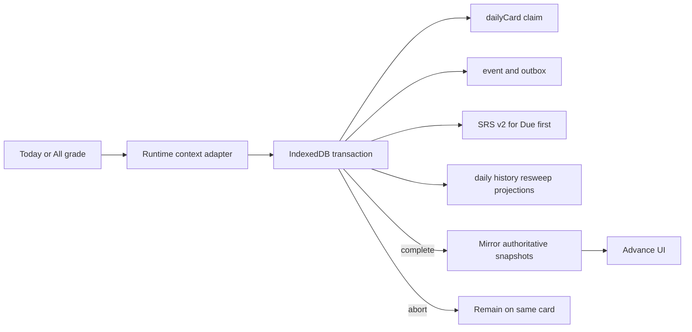
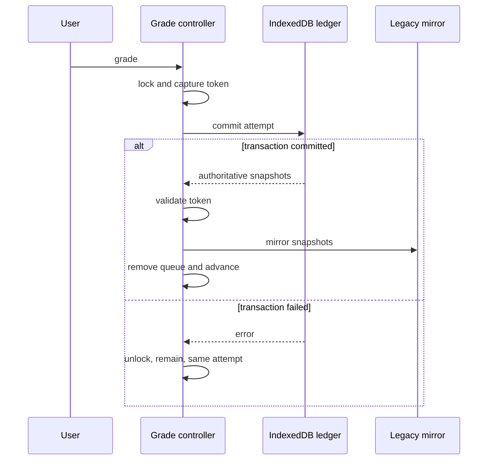

# Runtime Practice Ledger Wiring - Plan

## Goal Capsule

把現行 Today／All cards 評分接進既有 IndexedDB practice ledger。被納入的作答必須先完成耐久 transaction，畫面才前進；正式 Due first 才推進 SRS，其他 lane／retry 只留下練習事實。既有 localStorage 資料保留為相容投影，reload 必須能由 IndexedDB 修復，不重算、不漏算、不灌水。

## Product Contract

### Key Decisions

- **KD1 — Today／All lane 語意**（session-settled: user-approved；Governs R1–R3）：Today 真正到期為 `due`、重新掃描為 `sweep`、弱項補位為 `weak`；All 真正到期為 `due`，其他為 `sweep`。
- **KD2 — 同日同卡重試**（session-settled: user-approved；Governs R3、R5）：同日同卡只有第一筆是 `first`；第二、第三筆為 `retry-1`／`retry-2`，第四筆進 `retry-limit`，不新增 event、SRS 或正式統計。
- **KD3 — Ledger-first**（session-settled: user-approved；Governs R6–R9、R13）：交易完成前 UI 不前進；失敗留在原卡，以同一 attempt 重試。相容投影失敗不重送已完成 transaction。
- **KD4 — 本輪邊界**（session-settled: user-approved；Governs R1、R14–R16）：只接 `__TODAY__` 與 `__ALL__`；不實作完整四軌 engine、不新增 Supabase practice-event schema、不 merge `main`。

### Requirements

- **R1**：只有 `currentLessonId === '__TODAY__'` 或 `__ALL__` 進 ledger；單堂、收藏、搜尋等維持舊路徑。
- **R2**：lane 由 queue snapshot 或 authoritative SRS 判斷，不由 grade 反推；Today 的 Due／resweep overlap 以 Due 勝出。
- **R3**：以 `[workspaceId, dayKey, cardId]` 做跨 Today／All、跨 lane 的唯一 first claim，並沿用 first 的 attempt／round／cycle／lane。
- **R4**：runtime baseline 必須同時通過 current catalog 與 trusted production lineage evidence；只 add missing `srsV2` version 0，既有 IDB row 永遠勝出。
- **R5**：只有 `due + first` 可帶 `formalGrade` 並寫 SRS after-state；Sweep／Weak／retry 不碰 SRS、reviewed、accuracy 或 formal history。
- **R6**：claim、event、SRS、daily/history/resweep projections 與 outbox 在同一 transaction commit 或全部 abort。
- **R7**：daily ledger projection 保存完整 authoritative snapshot；localStorage day 的 top-level counters 是 legacy contribution，`day.ledger` 是 ledger contribution。
- **R8**：grade history 可保存第三欄 `eventId`，同 event replay 冪等；舊 `[code,timestamp]` tuple 仍可讀與合併。
- **R9**：resweep acknowledgement 綁 event／expected card／position／catalog digest；重播不多推，retry-limit 可 ack cursor 但不造 event。
- **R10**：v1 cloud pull winner 必須先用 trusted resolver 匯入 IDB，再鏡像 state；同 snapshot 重拉冪等，不合成 practice event。
- **R11**：remote reset epoch 先清 IDB mutable SRS/runtime cursor/baseline state，再清 local mirror；append-only events 與已提交 projections 保留。
- **R12**：boot 每次 reconcile IDB projections；catalog digest 改變時 invalidate runtime context，重新 audit baseline 前不開放 ledger grading。
- **R13**：async 評分共用 pending guard；saving 期間鎖評分與所有人為 context mutation，背景 mutation 以 operation token 阻止錯卡套 projection。
- **R14**：現有 legacy 評分路徑、遊戲、秒數、保護、補救與 remote-days 隔離語意不得回歸。
- **R15**：新 runtime import graph 納入 Service Worker SHELL，cache 版本升級，缺少 JS／CSS 不得被 `200 text/html` 冒充成功。
- **R16**：Node、Python、served-origin browser、fresh App、direct Pages deploy 與資產 hash read-back 全部通過才算發布。

### Acceptance Examples

- **AE1**：Today Due first 從既有 reps／interval／ease baseline 延續到 version 1；event、claims、SRS、daily/history projection、outbox 原子存在。
- **AE2**：Today Sweep／Weak 與 All 非 Due 只增加 practice attendance，不改 SRS 或正式 reviewed。
- **AE3**：Today 與 All 兩個 tab 同時評同卡，只產生一筆 first；另一筆取得既有 context 並進 retry 或留在原卡重試。
- **AE4**：transaction abort、quota、blocked、versionchange、workspace switch 都不留下半套資料，UI 不假前進。
- **AE5**：commit 後、localStorage mirror 前 crash，reload 由 IDB 看到相同 SRS version、daily/history/resweep snapshot，數字不缺不重。
- **AE6**：v1 pull／reset 後 reload 不會回到舊 IDB 狀態；collision 或不可信 lineage 只 quarantine，不猜 card identity。
- **AE7**：saving 時鍵盤、按鈕、swipe、換模式／課程、shuffle、搜尋跳卡都不能改 context；背景 catalog/cloud 變動使舊 token 失效且不套錯卡。
- **AE8**：部署 read-back 能證明 SW、data、lineage、manifests 與 runtime ledger modules 都等於本地 package。

### Scope Boundaries

- 不做完整 U6 四軌 queue engine、retry 插回位置或新首頁 primary CTA。
- 不新增或修改 production Supabase schema，不上傳 practice outbox。
- v1 `thai_days` 沒有 `practice` 欄位；本輪只保證 practice-only attendance 的本機連續性，不宣稱跨裝置同步。
- 不重跑 lineage 產生器、不改 trust constants、不刪 practice events、不降 IndexedDB 版本。
- 不拆分 `app.js`／`storage-scope.js` 大模組，不 merge `main`。

## Planning Contract

### Key Technical Decisions

- **KTD1**：新增 `src/practice-runtime.js`，domain adapter 不碰 DOM、storage 或 network。
- **KTD2**：保留 DB 名稱 `thai-review-practice-v2`，schema version 由 2 升 3，新增 `dailyCardClaims`。
- **KTD3**：baseline 直接重用既有 trusted lineage normalization／SRS validator；不建立較弱 resolver。
- **KTD4**：`dailyCardClaims` 與既有 `formalDueClaims`／`dailyLaneClaims` 同 transaction 取得。
- **KTD5**：daily、history、resweep 都存進 `projections` store，`already-committed` 回傳完整 snapshot。
- **KTD6**：共同 `materializeDay()` 是唯一 legacy + ledger 統計入口；v1 uploader 上傳 materialized formal counters。
- **KTD7**：v1 pull／reset 是 compatibility bridge，先寫 IDB authority；不偽造 practice event。
- **KTD8**：operation token 至少包含 workspace generation、workspaceId、cardId、mode/lesson、context epoch、catalog digest、attemptId。
- **KTD9**：中央 controller 管 pending／saving／save-failed／projection-repair；click 與 keyboard 共用同一入口。
- **KTD10**：Service Worker 靜態 import graph 與 deploy package/read-back 都要驗證新 runtime modules。
- **KTD11**：正式 Due 的 after-state 只由 `commitPracticeAttempt()` 呼叫一次 `nextReview()`，UI 不再重算。

### High-Level Flow

## Implementation Units

### U1. 建立 runtime identity／classification adapter

- **Goal:** 將 Today／All UI context 純轉換成可驗證的 lane、phase、result 與 immutable operation snapshot。
- **Requirements:** R1–R3、R5；KD1–KD4；KTD1、KTD8。
- **Dependencies:** none。
- **Files:** Create `src/practice-runtime.js`、`tests/practice_runtime.test.mjs`; narrowly modify `src/card-identity.js` only if a reusable exported guard is required。
- **Approach:** 實作 grade→result、Today lane snapshot、All authoritative due 判斷、first/retry phase、retry-limit、UUID round/cycle/attempt context 與 context digest validation。
- **Execution note:** Test-first；純函式，不 import DOM、localStorage、IndexedDB 或 network。
- **Test scenarios:** Today due/sweep/weak、Due+resweep overlap、All due/non-due/missing baseline、四 grade mapping、跨入口沿用 first context、retry-limit、missing/ambiguous ID、digest drift。
- **Verification:** `TZ=Asia/Taipei node --test tests/practice_runtime.test.mjs`。

### U2. 升級 IDB v3 並建立可信 baseline／authority ports

- **Goal:** 加入跨入口 daily-card claim、projection API、add-only runtime baseline 與 v1 import/reset authority primitives。
- **Requirements:** R3–R4、R6、R10–R12；KTD2–KTD4、KTD7。
- **Dependencies:** U1。
- **Files:** Modify `src/practice-db.js`、`src/storage-scope.js`、`tests/practice_db.test.mjs`、`tests/storage_scope.test.mjs`、`tests/browser/practice-db-browser.mjs`。
- **Approach:** DB version 3 additive upgrade；新增 `dailyCardClaims`；runtime port 提供 claim/context/baseline 方法；baseline 同時驗 current catalog、trusted lineage、SRS shape，逐列 add-only，非法列 quarantine；新 store 納入 claim eligibility counts。
- **Execution note:** Test-first；保留 transaction 前、中、complete 後 `assertActive()` 與 DB 名稱。
- **Test scenarios:** v2→v3 保留 rows、Today/All cross-lane uniqueness、valid seed v0、existing IDB wins、historical collision/incomplete evidence/duplicate ID/invalid shape quarantine、rerun idempotence、workspace/versionchange/abort 無半套 seed。
- **Verification:** focused Node tests + served-origin DB upgrade/read-back fixture。
- **Deviation（2026-09-02 審查後）:** import/reset primitives（`getAllSrs`／`deleteSrs`／`deleteProjection`／`deleteWorkspaceMeta`／syncCursor 存取）本來排在 U2，實作時發現沒有任何 caller，已移到 U5 跟真正的 reconciliation 一起加——它們不是 schema，補加不需要再升 IDB 版本。practice port 的 `getProjection`／`putProjection` 則在 U3 有真正的 caller，該單元再加回。U5 動工前先確認 reset 那批還不存在。見 commit 198f884。

### U3. 原子提交 daily-card claim 與 authoritative projections

- **Goal:** 讓 committed／already-committed 都回傳一致的 SRS、daily、history、resweep snapshots。
- **Requirements:** R3、R5–R9；KTD4、KTD5、KTD11。
- **Dependencies:** U2。
- **Files:** Modify `src/practice-commit.js`、`src/practice-db.js`、`tests/practice_commit.test.mjs`、`tests/browser/practice-db-browser.mjs`。
- **Approach:** transaction stores 納入 `dailyCardClaims`／`projections`；first claim 保存完整 attempt context；daily Due first 增 reviewed/grade，其他 saved attempt 增 practice；history 以 eventId 冪等；resweep receipt 綁 expected state；retry-limit 只做合法 ack。
- **Execution note:** Test-first；新增每個 projection 的 replay/collision/abort proof，再改 production code。
- **Test scenarios:** AE1–AE5、Today/All concurrent first、payload drift、retry-limit ack、wrong resweep card/position/digest、transaction abort 零半套。
- **Verification:** focused Node tests + real IndexedDB concurrency/abort/reload fixture。

### U4. 建立 legacy daily／history／resweep 相容投影

- **Goal:** 以共同 materializer 把 legacy contribution 與 ledger snapshot 安全呈現、上傳與重播。
- **Requirements:** R7–R9、R14；KTD5、KTD6。
- **Dependencies:** U3。
- **Files:** Modify `src/today.js`、`src/cloud-merge.js`、`src/grade-history.js`、`src/resweep.js`、`src/state.js` 與對應 tests。
- **Approach:** `materializeDay()` 不改輸入；`dailyDays()` 與 uploader 共用；practice 只影響 attendance；history 保留 optional eventId；resweep mirror 改 set authoritative position，不再 UI `+=1`。
- **Execution note:** Characterization-first：先釘住 legacy-only days/history/resweep 行為，再新增 ledger cases。
- **Test scenarios:** legacy-only/ledger-only/sum/idempotence、own+remote 不膨脹、practice 不冒充 formal、history 新舊 tuple/cloud round-trip、resweep replay/crash repair/retry-limit。
- **Verification:** `tests/today.test.mjs`、`tests/cloud_merge.test.mjs`、history/resweep tests 全綠。

### U5. 接上 boot reconciliation、v1 cloud import/reset 與 catalog fence

- **Goal:** 讓 IDB authority 在 boot、pull、reset、catalog refresh 後保持單調且可重開修復。
- **Requirements:** R4、R10–R12、R14；KTD3、KTD7、KTD8。
- **Dependencies:** U2–U4。
- **Files:** Modify `src/app.js`、`src/cloud-sync.js`、`src/state.js`、`src/storage-scope.js`、`tests/cloud_sync.test.mjs`、`tests/workspace_boot.test.mjs` 與 storage tests。
- **Approach:** boot 先完成 legacy backfill boundary，再逐日覆寫 nested ledger；v1 winner 轉 stable ID 後進 IDB，保存 provenance/stamp；authenticated reset blocking reconciliation 先 IDB 後 mirror；catalog digest 變動 invalidate context 並重跑 baseline audit。
- **Execution note:** Proof-first；每個 crash/ownership race 先有 failing integration test。
- **Test scenarios:** existing daily key 仍 reconcile、backfill 不雙算、pull reload 保留/重拉冪等/collision quarantine、reset 各 crash point不復活、logout/account switch隔離、catalog refresh stale token不套用。
- **Verification:** focused cloud/boot/storage suites + reload integration。
- **Deviation（2026-09-02 實作時）:** R11 寫「清 baseline state」，實作只清 `runtime-context`，**保留 `runtime-srs-baseline-v1` 的 `seededAliases`**。那份紀錄是 U2 定案的 add-only 語意裡「重置掉的進度不准被 legacy progress 救回來」的唯一依據；清掉的話下次開機 baseline 會從還沒被同步清乾淨的 legacy progress 整批重新 seed，重置形同無效。端到端測試釘在 `tests/storage_scope.test.mjs`「R11：重置後再跑一次 baseline，被重置掉的卡不會復活」。見 commit b94f1ef。這條需要 Nalin 或原作者確認。

### U6. 接上 async 評分 controller 與 UI context guard

- **Goal:** Today／All 只透過 ledger-first coordinator 評分，saving 期間不允許錯卡或重複提交。
- **Requirements:** R1、R5–R6、R13–R14；KTD8、KTD9、KTD11。
- **Dependencies:** U1–U5。
- **Files:** Create `src/practice-grade-controller.js` if controller cannot stay cohesive in `practice-runtime.js`; Modify `src/app.js`、`src/card.js`／`src/ui.js` only as needed、`styles/components.css`、relevant tests。
- **Approach:** boot-bound port；click/keyboard 共用 CAS pending guard；capture token；committed/already-committed 才 mirror/advance；commit fail 保留 same attempt；mirror fail 進 projection-repair；guard arrows/prev-next/swipe/mode/lesson/shuffle/search/jump/SRS toggle；background mutation bump epoch。
- **Execution note:** Test-first controller；DOM wiring 另加 caller-level test，不能只測 helper。
- **Test scenarios:** click+key double submit、saving navigation/context lock、failure zero side effects、same-attempt retry、already-committed replay、mirror failure no re-commit、workspace/catalog/context invalid token、legacy contexts unchanged、a11y saving/error/focus。
- **Verification:** focused controller/app tests + 320px/desktop keyboard and touch browser QA。

### U7. 更新 Service Worker、release gates 與 production read-back

- **Goal:** 讓新 runtime modules 真正進 deployment package，並用 fresh browser 證明四條評分路徑與 crash safety。
- **Requirements:** R15–R16；KTD10。
- **Dependencies:** U6。
- **Files:** Modify `sw.js`、`tests/service_worker.test.mjs`、`scripts/update-audio-deploy.sh`、browser fixture/version、release docs/handoff。
- **Approach:** cache v95→v96；SHELL 包含完整 import graph；precache 對 `.json/.js/.css` 拒收 HTML fallback；deploy-info/read-back 納入 lineage 與 runtime owner modules；dry-run 若出現付費缺口就停止。
- **Execution note:** Characterize current v95/package/read-back first；deployment 只在全部本機 gate 與 fresh-context review 通過後執行。
- **Test scenarios:** import graph/SHELL/staging、missing JS HTML fallback、runtime SHA mismatch fail、served-origin delayed transaction/abort/versionchange/workspace switch/two-tab/reload、Today Due/Sweep、All Due/non-Due。
- **Verification:** 完整 verification contract、direct Pages deploy、per-deployment URL hash read-back、fresh page source/cache/runtime smoke。

## Verification Contract

| Gate | Command or action | Done signal |
|---|---|---|
| JavaScript | `TZ=Asia/Taipei node --test tests/*.test.mjs` | 全綠；包含 classification、baseline、claim、projection、cloud/reset、UI guard、SW tests |
| Python | `TZ=Asia/Taipei python3 -m unittest discover -s tests -p '*_test.py'` | 全綠；既有資料／部署流程無回歸 |
| Diff hygiene | `git diff --check` + selective status | 無 whitespace error；沒有原工作目錄的 `data.json` 或無關檔案 |
| Browser storage | served-origin `tests/browser/practice-db.html` | v2→v3、abort、two-tab、reload、versionchange、workspace switch 全過 |
| Fresh App | Today Due/Sweep、All Due/non-Due；click/key、reload、offline/online、context mutation | ledger-first、無雙算、失敗留卡、token 不錯套 |
| Fresh-context review | `ce-code-review` 或同級 fresh agent | 無未處理 P0/P1；P2 有明確處置 |
| Preview/deploy | `bash scripts/update-audio-deploy.sh --deploy` | dry-run 無付費缺口；direct upload 成功 |
| Read-back | deployment URL 的 deploy-info、SW、data、lineage、manifests、runtime modules hashes | 全部等於本地 package；fresh page 顯示新 source/cache |

## Definition of Done

- U1–U7 的非延後項目都有觀察到的驗證結果。
- AE1–AE8 均由 Node、Browser 或 production read-back 證明。
- Today／All 以 ledger-first 評分；其他模式維持既有路徑。
- DB v3 additive upgrade 不遺失既有 workspace rows，baseline 不重建歷史 collision。
- 所有 crash／replay／two-tab／workspace switch case 無半套 state、無 SRS 雙算、無 daily/history/resweep 灌水。
- v1 pull/reset 不再繞過 IDB authority；practice-only attendance 的跨裝置限制在 UI／handoff 中如實揭露。
- 新 modules 已進 SW、deploy package 與 hash read-back；Node、Python、Browser、fresh review 全綠。
- `codex/hybrid-mastery-release` selective commit/push 完成；不 merge `main`。
- Cloudflare Pages direct deploy/read-back 完成；更新 `000_Agent/memory/codex_to_claude_handoff.md` 與 repo handoff。
