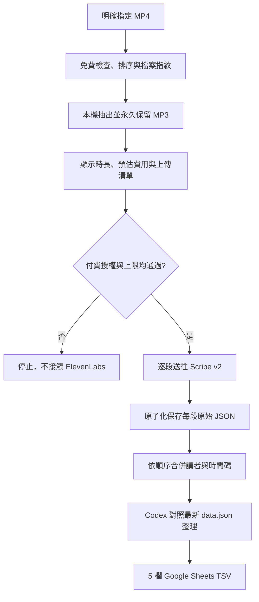
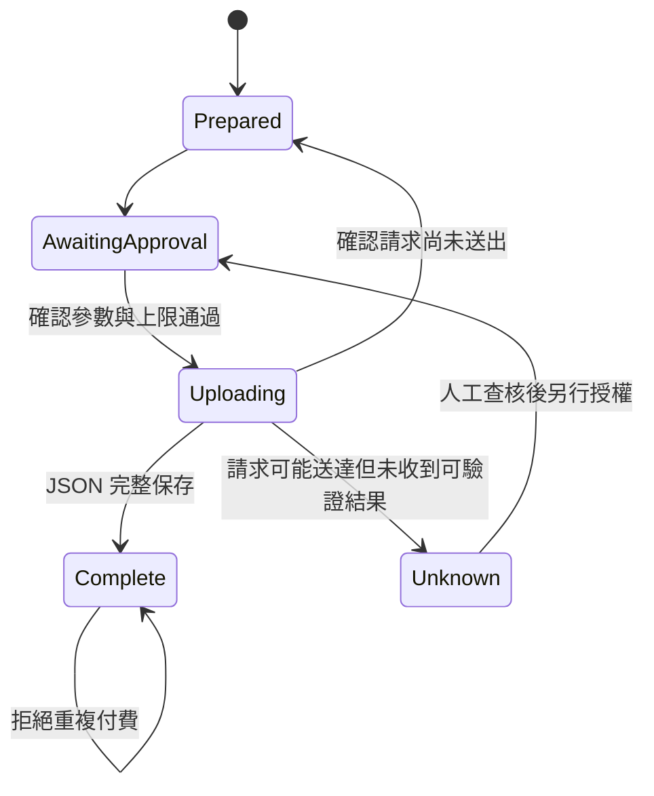

# 泰語課 MP4 → ElevenLabs Scribe v2 → Google Sheets TSV 設計

日期：2026-08-16（Asia/Taipei）
狀態：使用者已確認設計，尚未實作

## 1. 問題與目標

Nalin 平常收到的是兩段長時間泰語課錄影，例如上半場約 1 小時、下半場約 30 多分鐘的 MP4。現況需要手動逐段抽音並轉成 MP3，再另外處理轉錄與 Sheet 格式，耗時且容易重複工作。

本功能要在 Thai Review repo 內提供一個明確指定檔案的命令列流程。Nalin 把一支或多支 MP4 交給 Codex 後，Codex 能安全完成本機檢查、MP3 轉檔、付費預估、ElevenLabs Scribe v2 轉錄、原始結果保存、逐字稿合併與 Google Sheets TSV 整理。

成功標準：

- Nalin 不必手動切割或轉檔。
- 原始 MP4 永遠保持不變。
- 轉出的 MP3 與 Scribe JSON 長期保留，流程不自動刪除。
- 沒有明確付費確認時，ElevenLabs 網路請求必須為 0。
- 同一份錄音不得因重跑或網路失敗而默默重複付費。
- 最終 TSV 保持上課順序、每列 5 欄、無表頭，且可直接貼入 Google Sheet。

## 2. 範圍

### 本次包含

- 明確指定一支或多支 MP4。
- 依檔名數字尾碼排序，例如 `260814-1.mp4`、`260814-2.mp4`。
- 使用 `ffprobe` 讀取影片與音軌資訊。
- 使用 `ffmpeg` 抽出 16 kHz、單聲道、64 kbps MP3。
- 使用內容指紋建立可恢復的工作紀錄。
- 顯示總長度、估計費用、上傳目的地與計費功能。
- 經明確授權後呼叫 ElevenLabs Scribe v2 Batch Speech-to-Text API。
- 保存每段原始 JSON，並依檔案順序合併講者與時間碼。
- 由 Codex 對照當下最新 `data.json`，整理成固定 5 欄 TSV。
- 免費自動測試、模擬 API 整合測試，以及一次性小額真人錄音驗收。

### 本次不包含

- 不監看資料夾或建立 LaunchAgent。
- 不自動掃描並猜測要處理哪些影片。
- 不平行上傳上下半場。
- 不使用 Scribe Realtime。
- 不啟用 Keyterms、Entity Detection、角色偵測或多聲道等額外計費功能。
- 不自動把 TSV 寫入 Google Sheet。
- 不自動刪除 MP3、JSON 或原始 MP4。
- 不在這次把流程抽成全域 skill；先在專案內跑穩 2 至 3 堂再評估。

## 3. 選定方案

採用「明確指定檔案的單一專案指令」。這比資料夾掃描或背景監看更容易驗證輸入範圍，也能在付費前明確列出要送往 ElevenLabs 的檔案。

第一版允許一支影片或多支影片。多支影片必須有可判斷的共同前綴與數字尾碼；若檔名不一致、尾碼重複或排序有歧義，流程停止並要求人工修正檔名，不自行猜測。

## 4. 高階資料流



## 5. 專案檔案配置

受 Git 管理：

```text
scripts/transcribe-class.py
tests/transcribe_class_test.py
docs/thai-class-audio-workflow.md
AGENTS.md
```

### `scripts/transcribe-class.py`

單一專案腳本，負責：

- 解析與驗證明確指定的輸入檔。
- 排序分段、探測媒體、產生內容指紋。
- 呼叫 `ffmpeg` 產生 MP3。
- 建立與更新 `job.json` 狀態。
- 產生費用預檢報告並執行付費閘門。
- 逐段呼叫 ElevenLabs Scribe v2。
- 安全保存原始 JSON 與合併逐字稿。

第一版維持單一腳本，沿用 repo 既有 `scripts/gen-audio.py` 搭配 `unittest` 的簡單模式；若實作後檔案責任確實過大，再在不改變 CLI 契約的前提下拆出內部模組，不先做抽象化。

### `tests/transcribe_class_test.py`

以 Python `unittest` 為主，涵蓋純邏輯、媒體整合、模擬 API 與付費防呆。一般測試不得使用真正 ElevenLabs key 或產生付費請求。

### `docs/thai-class-audio-workflow.md`

記錄使用方法、免費與付費邊界、輸出位置、錯誤恢復、真人驗收流程，以及 API 資料會送往 ElevenLabs 的揭露事項。

### `AGENTS.md`

只追加專案觸發規則：使用者要求「整理泰語課錄音」時，先走本腳本的免費預檢與轉檔；任何 ElevenLabs 上傳都必須經付費閘門。詳細操作留在 workflow 文件，避免規則檔膨脹。

## 6. 工作產物配置

每堂課產物放在既有 Git ignore 的 `out/`：

```text
out/class-transcriptions/260814/
├── job.json
├── audio/
│   ├── 260814-1.mp3
│   └── 260814-2.mp3
├── scribe/
│   ├── 260814-1.json
│   └── 260814-2.json
├── 260814-combined-transcript.txt
└── 260814-Google-Sheets.tsv
```

規則：

- MP3 與 Scribe JSON 長期保留，流程不自動刪除。
- 原始 MP4 只讀取，不複製、不改名、不刪除。
- `job.json` 保存來源路徑、內容指紋、媒體資訊、估價依據、每段狀態與可取得的 request ID，但不得保存 API key。
- 同一工作目錄已有相同內容指紋時沿用既有 MP3 與成功的 Scribe JSON。
- 同名工作目錄存在、但來源內容不同時停止，不覆蓋舊產物；使用者需改用新的工作 ID。

`out/` 是本機且不進 Git；「保留」只代表本流程不自動刪除，不等於已有異地備份。若日後需要備份或跨裝置存取，另行規劃封存位置，不把它混進第一版。

API key 置於 repo 外的本機安全檔案：

```text
~/.secrets/elevenlabs-stt.env
```

它只開 `speech_to_text` 權限、檔案權限為 `0600`，並與既有 Thai Review TTS key 分離。

## 7. ElevenLabs 請求契約

使用官方 Batch Speech-to-Text endpoint 與 `scribe_v2`：

- 中泰混合錄音不鎖定單一語言，交由 Scribe v2 自動辨識。
- 啟用講者辨識與 word-level timestamps。
- `no_verbatim` 保持關閉，避免刪掉老師刻意重複、修正或拆解的教學內容。
- 關閉 audio event tags。
- 不啟用 multi-channel，避免立體聲來源被分軌重複計費。
- 不啟用任何額外計費附加功能。
- 上下半場依序上傳；一段成功後立即安全保存，再處理下一段。

官方參考：

- [Create transcript API](https://elevenlabs.io/docs/api-reference/speech-to-text/convert?explorer=true)
- [Speech-to-Text overview](https://elevenlabs.io/docs/overview/capabilities/speech-to-text/)
- [ElevenLabs API pricing](https://elevenlabs.io/pricing/api?price.section=speech_to_text)

## 8. 付費安全設計

### 免費預設

沒有 `--confirm-paid-api` 時：

- 可以探測影片、計算費用與產生 MP3。
- 不得呼叫 Scribe endpoint。
- 測試必須證明 ElevenLabs 網路請求數為 0。

### 雙重上限

即使提供確認參數，第一版仍有硬上限：

- 單次總長度最多 120 分鐘。
- 預估費用最多 USD 0.50。

超過任一上限時停止，必須重新揭露範圍並取得新授權。估價以當時文件確認的 Scribe v2 單價為基準，報告需標示單價與查核日期；估價不宣稱是最終帳單。

### 授權綁定來源

付費前重新驗證 MP4 與 MP3 指紋。任何來源變更都使前一次授權失效。已存在成功 Scribe JSON 的內容指紋不得再次上傳。

### 不確定結果

每段有獨立狀態：



若檔案可能已上傳完成，但連線中斷、程序終止或回應無法驗證：

- 將該段標記為 `unknown`。
- 不自動重試。
- 保留來源指紋、時間、估價與可取得的 request ID。
- 先查 ElevenLabs 使用紀錄。
- 確認需要重送後，必須同時提供 `--confirm-paid-api` 與 `--force-paid-retry`。

### 秘密與隱私

- API key 不得出現在 stdout、stderr、log、`job.json`、測試快照或 Git。
- 付費前揭露上傳目的地、檔案清單、總長度、估價與資料留存限制。
- ElevenLabs 標準 API logging 會保留轉錄紀錄；Zero Retention 依官方文件僅限 Enterprise。使用者核准的是音訊上傳與相應資料處理，不只是費用。

## 9. 錯誤處理與恢復

- 缺少 `ffprobe`、`ffmpeg`、`curl` 或 STT key：付費前停止並指出缺少項目。
- MP4 沒有可用音軌、檔案損壞或輸出 MP3 為 0 bytes：停止，不建立可上傳狀態。
- 權限不足：顯示 STT key 權限錯誤，不改用 TTS key。
- `429`、`5xx`、逾時或非法 JSON：保存已知狀態；只有能確認請求尚未送達時才允許安全重試。
- 寫入 JSON 時先完成暫存檔，再原子化取代正式檔；只有正式 JSON 可解析且內容完整時才標記 `Complete`。
- 上半場成功、下半場失敗：保留上半場結果，重跑時只處理下半場。

## 10. 測試策略

### 純邏輯測試

- 數字尾碼排序正確。
- 單一影片可執行。
- 不同日期、重複尾碼、缺檔、空檔與非 MP4 被拒絕。
- 時長、估價、工作 ID 與輸出路徑正確。
- 相同內容可沿用；同名不同內容拒絕覆蓋。

### 本機媒體整合測試

在臨時目錄產生兩支數秒測試影片：

- `ffprobe` 能取得媒體資訊。
- MP3 非空白、可解碼，且為單聲道、16 kHz、64 kbps。
- MP3 時長與來源合理一致。
- 原始 MP4 前後 hash 相同。
- 第二次執行沿用既有 MP3。

### 模擬 ElevenLabs 測試

- 正常 JSON 會安全保存並合併。
- 第二段時間碼加上前一段長度，順序正確。
- 講者、文字與時間碼保留。
- `401`、`429`、`5xx`、逾時、斷線與非法 JSON 各有明確狀態。
- 一般測試使用假的 HTTP endpoint 或 mock，不接觸真正 ElevenLabs。

### 付費防呆測試

- 沒有確認參數時網路請求數為 0。
- 超過分鐘或 USD 上限時拒絕上傳。
- 已成功項目拒絕重送。
- `unknown` 不得自動重送。
- 來源 hash 改變會使核准失效。
- multi-channel 與其他加價功能保持關閉。
- TTS key 缺少 `speech_to_text` 時在上傳前失敗。

### 一次性付費驗收

所有免費測試通過後，使用已有 43 列人工正解的 `260724-04-複習.mp3` 做一次小額驗收。這只驗證 Scribe API 與 Codex 整理的後半段品質，不改變正式 CLI 只接受 MP4 的產品範圍。上傳前仍需重新揭露目的地、時長與估價，並取得明確授權。

驗收記錄：

- API 實際等待時間。
- Scribe 原始文字對已知 43 列泰文的涵蓋率與重大遺漏。
- 幻覺或混合語言錯誤。
- Codex 整理後的人工修正量。

最終 TSV 驗收：

- 每列恰好 5 欄。
- 無表頭與編號。
- Karaoke 不含 `-`。
- 無完全重複列。
- 單字、詞組、例句維持上課順序。
- 只刪真正語意重複，保留語氣詞、肯定／否定與性別／禮貌差異。

## 11. 後續評估

實際跑穩 2 至 3 堂課後，再依下列證據決定是否抽成 skill：

- 是否在 Thai Review repo 以外也頻繁使用。
- Scribe 參數與整理規則是否已穩定。
- 是否需要跨 Codex／Claude 在任意工作目錄呼叫。
- 是否仍有大量依賴本專案 `data.json`、Sheet 格式或部署流程的專案特定行為。

在此之前，專案腳本與 workflow 文件是唯一實作來源；skill 不會複製一份容易漂移的流程。
